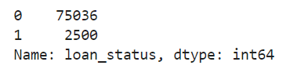
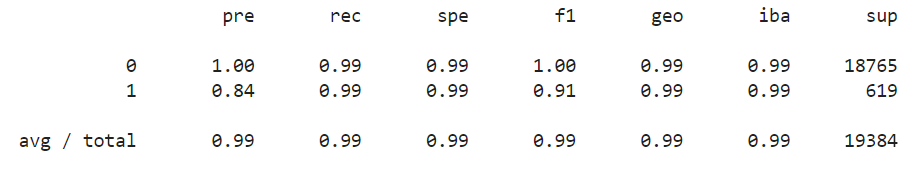

# Module 12 Challenge - Credit Risk Classification

## Description

In this Jupyter Lab Notebook, we combine financial Python programming skills with or new supervised learning skills to evalulate and classify different loan data into a "healthy loan" status or a "high risk loan" status using supervised machine learning.

In this notebook we use a Logisitic Regression model fit with the original data, as well as fit with oversampled data so we are able to compare results between the two methods. 

The sections of this notebook are as follows: 

* Split the Data into Training and Testing Sets
* Create a Logistic Regression Model with the Original Data
* Predict a Logistic Regression MOdel with Resampled Training Data
* Write a Credit Risk Analysis Report (Located in this README.md file, Section *Credit Risk Classification Report*)

---

# Credit Risk Classification Report

## Overview of the Analysis

In the this analysis, we evaluate lending data from a peer-to-peer lending services company and using supervised machine learning techniques, along with financial Python programming skills, we use this data to train and evaluate models to determine the creditworthiness of borrowers.  The dataset is inherently imbalanced due to the fact that "healthy" loans greatly outnumber "high risk" loans.  Due to this, we will evaluate the results of a trained model using the original data, as well as the results of a trained model using oversampled data.  The end goal of this analysis is to develop the best model to most accuratley predict whether a loan shall be classified as a "healthy" loan or a "high risk" loan.  Furthermore, we are more interested in identifying "high risk" loans as these tend to carry more risk for the firm and therefore need to be identified and managed more closely so it will be important to utilize a machine learning algorithim that tends to be more accurate, precise and higher recall in the "high risk" classification, especially since this is the minority group. 

The dataset that we are analzying contains 8 columns and 77,536 rows.  The column features include: loan_size, interest_rate, borrower_income, debt_to_income, num_of_accounts, derogatory_marks, total_debt and loan_status.  The loan_status variable is identified as `0` or `1`; `0` indicating a "healthy" loan status and `1` indicating a "high risk" loan status.  This is the `y` variable that we will use as our classification target.  

Analyzing the balance of our target value we see that that `0` greatly outweighs `1`. 



This balance discrepancy indicates why we will use both the original data to fit a model as well as oversampled data to fit a Logisitc Regression model.  

Logistic Regression is a modeling technique used to find the probability of a certain outcome for a dataset based off of prior observations.

Random oversampling is a resampling technique used to randomly select instances of the minority class variable and add them to the training set until the majority and minority classes are balanced. 

The stages of the machine learning process for this analysis are as follows:

* Split the Data into Training and Testing Sets
    * Randomly split the data so we have a portion of the data that we can train the model to as well as keep a portion of the data that we can use to test our model, and compare results.
* Create a Logistic Regression Model with the Original Data
    * Create a model, Fit the model using the training data, and use the model to make Predictions on the test data.
* Predict a Logistic Regression Model with the Original Training Data
    * Use the model to make predictions on the test data and analyze results.
* Create a Logistic Regression Model with the Resampled Data
    * Create a model, Fit the model using the resampled training data, and use the model to make Predictions on the test data.
* Predict a Logistic Regression Model with the Resampled Training Data
    * Use the model to make predictions on the test data and analyze results.
* Analalys and Compare Results

## Results

* Machine Learning Model 1 (Original Data):
  * Accuracy: 95.2%
  * `0` Precision: 100%
  * `0` Recall: 99%
  * `1` Precision: 85%
  * `1` Recall: 91%

Full Model 1 classification report as follows:   


* Machine Learning Model 2:
  * Accuracy: 99.4%
  * `0` Precision: 100%
  * `0` Recall: 99%
  * `1` Precision: 84%
  * `1` Recall: 99%


Full Model 2 classification report as follows:   




## Summary

When comparing the linear regression model, fit with the oversampeld data vs. fit with the original data, it seems that the although we lose slight precision (1%) in `1` values using the oversampled data, we gain an 8% increase in recall, meaning that 8% more (high-risk loans) are classified correctly when using the oversampled data.  This increse in `1` recall percentage causes an insignificant change for the `0` values so it is a win-win.  

As mentioned above, we are more interested in indentifying `1` values since these represent "high risk" loans so the second model is the best fit for this application.  This information could be very beneficial to the firm to make sure that high-risk loans are managed correctly since they pose more potential risk to the firm.  

---

## Technologies

This project leverages JupyterLab Version 3.0.14 in association with Anaconda distribution and the Conda package manager.  The following packages are also used: 

* [pandas](https://github.com/pandas-dev/pandas) - Data analysis toolkit for Python.

* [numpy](https://github.com/numpy/numpy) - Fundamental package for scientific computing with Python.

* [sklearn.metrics](https://scikit-learn.org/stable/modules/model_evaluation.html) - Quantify the quality of predictions.

* [sklearn.linear_model](https://scikit-learn.org/stable/modules/generated/sklearn.linear_model.LinearRegression.html) - LinearRegression modeling.

* [sklearn.train_test_split](https://scikit-learn.org/stable/modules/generated/sklearn.model_selection.train_test_split.html) - Split arrays or matrices into random train and test subsets.

* [imbalanced-learn](https://pypi.org/project/imbalanced-learn/) - Python package offering re-sampling techniques.

---

## Installation Guide

Before running the application, install Python modules Pandas, hvPlot, SQLAlchemy and Voila:

```python

  conda install pandas

  conda install numpy

  conda install -c conda-forge imbalanced-learn

  pip install -U scikit-learn

```
---

## Contributors

Joshua Creveling

Email: josh.creveling22@gmail.com

GitHub: https://github.com/joshuacreveling

LinkedIn: https://www.linkedin.com/in/joshua-creveling/

*Starter template provided by Trilogy Education Services*

---

## License

MIT